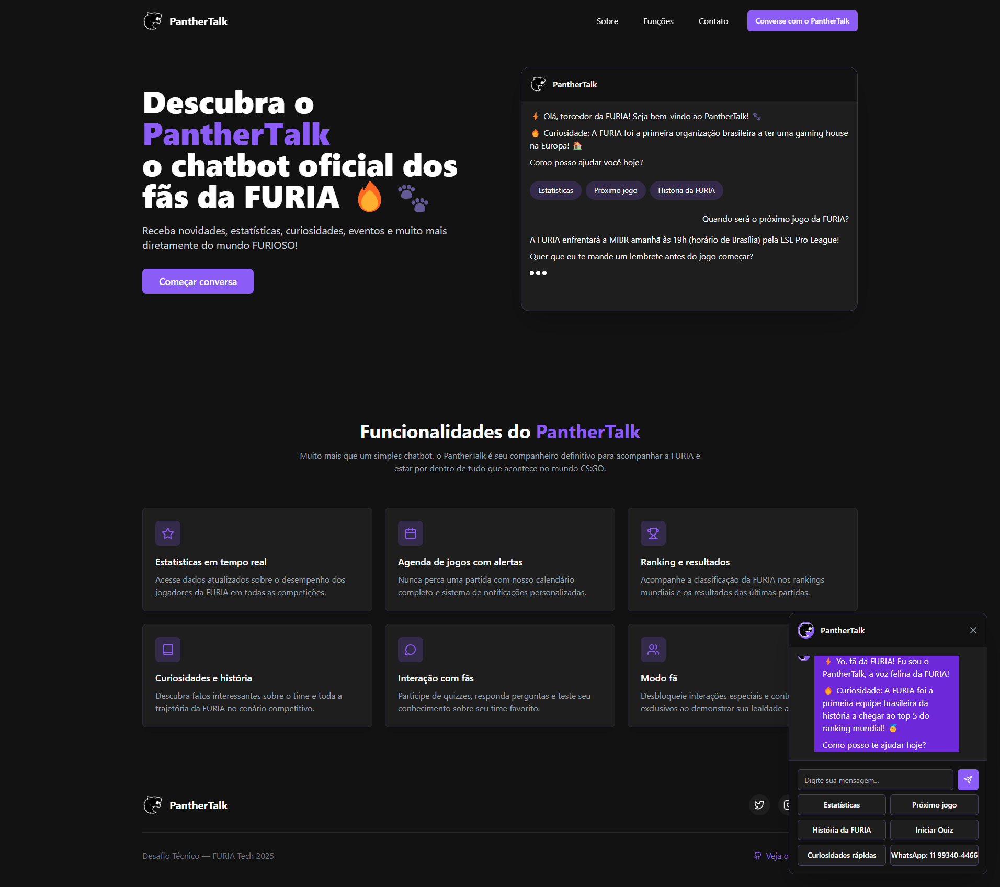

# PantherTalk — A voz felina da FURIA 🐾🔥

PantherTalk é um chatbot interativo feito para os fãs da FURIA Esports, oferecendo uma experiência conversacional completa e imersiva no universo da FURIA.

> Descubra estatísticas em tempo real, curiosidades, rankings, calendário de jogos e interaja com o universo FURIOSO de forma intuitiva, moderna e responsiva.

Acesse agora mesmo em: https://furia-panther-hub.lovable.app/

---

## 💻 Tecnologias e Ferramentas Utilizadas

- ⚛️ React 18 com TypeScript - Framework para construção de interfaces modernas
- 🎨 Tailwind CSS - Estilização responsiva e moderna
- 🧩 Shadcn/UI - Componentes reutilizáveis de alta qualidade
- 📊 React Query - Gerenciamento de estado e comunicação com APIs
- 🔍 Lucide React - Biblioteca de ícones
- 📊 Recharts - Visualização de dados (disponível para implementação)
- 📱 Interface 100% responsiva (mobile, tablet, desktop)
- 🔄 Vite - Ferramenta de build rápida e otimizada

---

## 📸 Visão Geral do Projeto



---

## 🔍 Funcionalidades

- **Estatísticas**  
  Visualização dos dados atualizados sobre o desempenho dos jogadores da FURIA.

- **Agenda de jogos com alertas**  
  Calendário completo de jogos com informações sobre as próximas partidas.

- **Curiosidades e história da FURIA**  
  Informações sobre a trajetória da organização e momentos marcantes no CS.

- **Sistema de Quiz**  
  Teste seus conhecimentos sobre a FURIA com nosso quiz interativo e ganhe badges exclusivos.

- **Easter Eggs**  
  Descubra mensagens especiais utilizando palavras-chave como "roar", "pantera" e "furia".

- **Contato direto**  
  Acesso fácil ao WhatsApp oficial da FURIA (11 99340-4466).

---

## 🤖 Como funciona o chatbot

- O PantherTalk é acessível via botão flutuante no canto inferior direito da tela ou através do botão na navegação principal.
- Ao clicar, uma janela de chat se abre com as seguintes opções:
  - Estatísticas
  - Próximo jogo
  - História da FURIA
  - Iniciar Quiz
  - Curiosidades rápidas
  - Contato via WhatsApp
- O chat possui animações de digitação para simular uma conversa real.
- Ao completar o quiz com 100% de acerto, você recebe um badge exclusivo "Sou FURIOSO".

---

## 🏗️ Instruções de Instalação e Configuração

### Pré-requisitos

- Node.js (versão 18 ou superior)
- npm ou yarn gerenciador de pacotes
- Git instalado para clonar o repositório

### Passo a passo para instalação

1. **Clone o repositório**
   ```bash
   git clone https://github.com/Furia-GGTech/PantherTalk.git
   cd panthertalk
   ```

2. **Instale as dependências**
   ```bash
   npm install
   # ou usando yarn
   yarn
   ```

3. **Inicie o servidor de desenvolvimento**
   ```bash
   npm run dev
   # ou usando yarn
   yarn dev
   ```

4. **Acesse o aplicativo**
   - Abra seu navegador e acesse `http://localhost:5173`

### Build para produção

Para gerar uma versão de produção otimizada:

```bash
npm run build
# ou usando yarn
yarn build
```

Os arquivos de build serão gerados na pasta `dist/`.

---

## 📁 Estrutura do projeto

```
panthertalk/
├── public/           # Arquivos estáticos
├── src/
│   ├── components/   # Componentes React
│   │   ├── chat/     # Componentes específicos do chat
│   │   └── ui/       # Componentes de UI reutilizáveis 
│   ├── constants/    # Constantes do projeto (opções do chat, easter eggs)
│   ├── data/         # Arquivos de dados (curiosidades, quiz)
│   ├── hooks/        # React hooks personalizados (useChatState)
│   ├── pages/        # Páginas/rotas da aplicação
│   ├── services/     # Serviços para comunicação com APIs (HLTV)
│   ├── types/        # Definições de tipos TypeScript
│   ├── utils/        # Funções utilitárias (chatHandlers)
│   ├── App.tsx       # Componente principal
│   └── main.tsx      # Ponto de entrada
└── tailwind.config.ts # Configuração do Tailwind CSS
```

---

## 🎯 Funcionalidades para personalização

O PantherTalk já vem pré-configurado, mas você pode personalizar:

1. **Configuração do chat**
   - Edite o arquivo `src/constants/chatConstants.ts` para modificar as opções do chat e easter eggs

2. **Dados da FURIA**
   - Atualize as informações no arquivo `src/data/furiaData.ts` para adicionar novos fatos, curiosidades ou perguntas do quiz

3. **Customização visual**
   - As cores e estilos principais podem ser modificados em `tailwind.config.ts` na seção de cores da FURIA

---

## 🐱 Identidade Visual

- Paleta de cores:  
  - Roxo FURIA: `#8B5CF6` (primário)
  - Roxo claro: `#A78BFA`
  - Roxo escuro: `#6D28D9`
  - Preto: `#121212`
  - Cinza escuro: `#1E1E1E`
  - Cinza claro: `#A1A1AA`

---

## 👤 Autor

**Italo Butinholi Mendes**  
Candidato a Assistente de Engenharia de Software FURIA 2025  
📧 [LinkedIn](https://www.linkedin.com/in/italo-butinholi-mendes/)

---

## 📌 Aviso

Este projeto foi desenvolvido como parte do desafio técnico para o processo seletivo de Assistente de Engenharia de Software da FURIA 2025. Todo o código e recursos utilizados respeitam as diretrizes de uso de imagem e identidade da FURIA Esports.